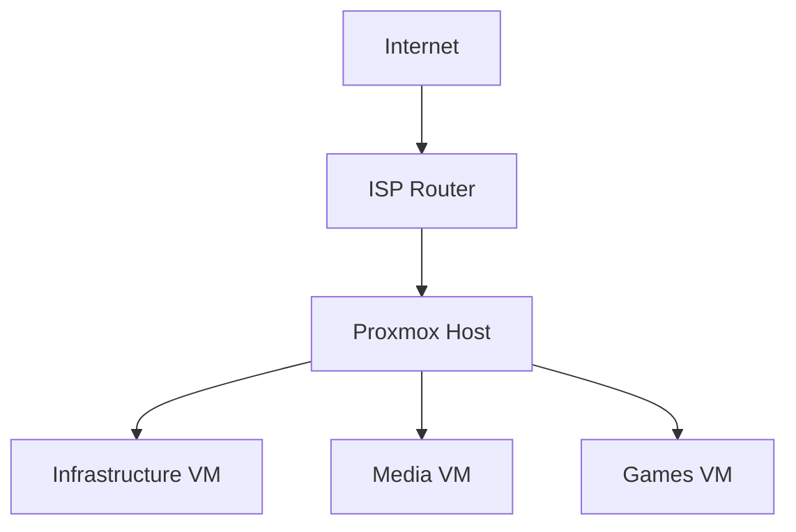
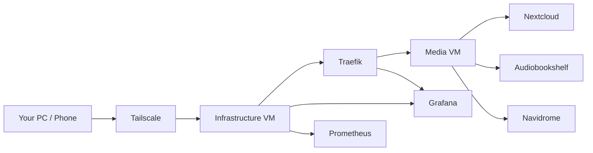
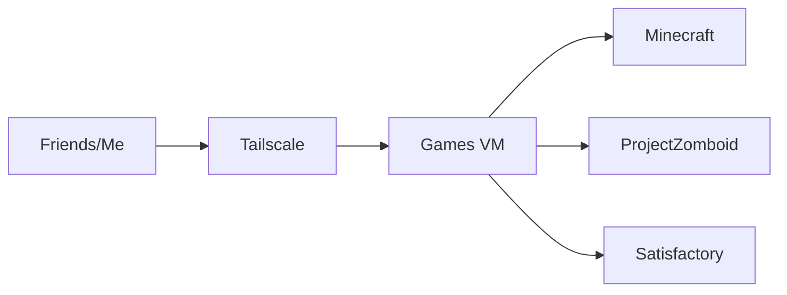

# Architecture

## Physical Host

HP Probook 440 G5

* Intel i7 8th Gen
* 16 GB RAM
* 500 GB SSD
* 1 TB HDD

Runs:

* Proxmox VE

---

## Physical Architecture

## Services Architecture

## Games Architecture

